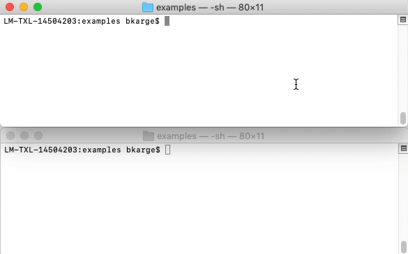

# kmake

kmake is a build tool with live rebuild support for c++ projects.

## Features
* generate project files for different IDE's/build systems
* `kmake.yml` file based configuration
* command line config support
* file watcher with live rebuild
  * add/edit/delete files and kmake will add the files to the project and compiles again
* export to directory/zip/tar/tar.gz/...
* assets support
* download assets and libs
* hooks support
* icon generation

## Supported IDE'S / build systems
 * Visual Studio 2019+
 * XCode
 * Makefile (GCC, Clang, MinGW)

## Requrements
* node.js >=14.14.0
* Windows:
  * Visual Studio 2019+
  * or MinGW (add it to your env-path)
* Mac:
  * Xcode or Clang
* Linux:
  * gcc
    * `sudo apt-get install gcc g++ make`

### SDL Exmaple
* `sudo apt install cmake libxext-dev`

### Vulkan Example
* `sudo apt-get update -y`
* `sudo apt install cmake libxrandr-dev libxinerama-dev libxcursor-dev libxi-dev`

## Installation
* `npm i -g kmake` (currently not available on npm - will be added in the future)

## Run
* `kmake your_kmake.yml your_project_template output_dir`

## Dev
* `npm run dev-mac` (Xcode - Intel and Apple Silicon)
* `npm run dev-vs` (Visual Studio 2019+)
* `npm run dev-mk` (Makefile - GCC, Clang, MinGW)

## Plaftorm settings
* see `examples/full/kmake.yml` as a full example

## Tips and tricks

* define strings via command line
  * `kmake --define TEST_DEFINE=\"test\"`

* makefile: building for archs which are not on your system.
  * use: install: `gcc-multilib` and `g++-multilib`
  * on debian/ubuntu use: `sudo apt-get install gcc-multilib g++-multilib`

* Inspect executable
  * on Mac: `otool -l BINARY`
  * on Linux: `ldd BINARY`

* create synlink to kmake.js
  * `sudo ln -s PATH_TO_KMAKE/kmake.js /usr/local/bin/kmake`